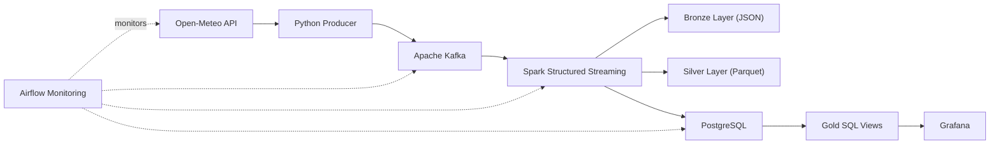

# Real-Time Weather Data Pipeline

[]()
[]()
[]()
[]()
[]()
[]()
[]()
[]()

A near real-time data engineering pipeline that collects weather observations from the Open-Meteo API, streams them through Apache Kafka, processes them with Spark Structured Streaming, stores them in PostgreSQL and visualizes them in Grafana.

---

## Overview

This project demonstrates the architecture of a modern streaming data platform using commonly adopted data engineering tools.

The pipeline continuously collects weather observations, transports them through Kafka, processes the events with Spark Structured Streaming, stores multiple data layers (Bronze, Silver and Gold), and exposes live dashboards through Grafana.

The whole stack runs locally using Docker Compose.

---

## Architecture



---

# Tech Stack

- Python
- Apache Kafka
- Spark Structured Streaming
- Apache Airflow
- PostgreSQL
- Grafana
- Docker Compose
- Open-Meteo API

---

# Project Structure

```
.
├── airflow/
├── producer/
├── spark/
├── postgres/
├── grafana/
├── docs/
├── data/
│   ├── bronze/
│   ├── silver/
│   └── checkpoints/
├── docker-compose.yml
├── .env.example
├── README.md
└── LICENSE
```

---

# Data Flow

```
Open-Meteo
      │
      ▼
Python Producer
      │
      ▼
Kafka Topic (weather.raw)
      │
      ▼
Spark Structured Streaming
      │
      ├────────► Bronze (JSON)
      │
      ├────────► Silver (Parquet)
      │
      ▼
PostgreSQL
      │
      ▼
Gold SQL Views
      │
      ▼
Grafana Dashboard
```

---

# Bronze / Silver / Gold

## Bronze

Raw events exactly as they were received from Kafka.

Purpose:

- replay
- audit
- debugging

Storage format:

```
JSON
```

---

## Silver

Cleaned and validated observations.

Operations include:

- schema enforcement
- timestamp conversion
- duplicate removal
- data quality filters

Storage format:

```
Parquet
```

Partitioning:

```
city/
    observation_date/
```

---

## Gold

SQL views optimized for analytics.

Current views include:

- weather_latest
- weather_hourly
- weather_observations_dedup

Grafana queries these views directly.

---

# Getting Started

## Prerequisites

- Docker Desktop
- Docker Compose v2

---

## Clone

```bash
git clone https://github.com/TonyDRAR/real-time-weather-data-pipeline.git

cd real-time-weather-data-pipeline
```

---

## Configure

Create a local environment file.

Git Bash / Linux

```bash
cp .env.example .env
```

PowerShell

```powershell
Copy-Item .env.example .env
```

The provided values are intended for local development and can be modified freely.

---

## Start the stack

```bash
docker compose up --build -d
```

Check running services

```bash
docker compose ps
```

The initial startup may take a couple of minutes while Spark downloads Maven dependencies and Airflow initializes its metadata database.

---

# Available Services

| Service | URL |
|----------|----------------------|
| Airflow | http://localhost:8080 |
| Kafka UI | http://localhost:8081 |
| Grafana | http://localhost:3001 |
| Spark UI | http://localhost:4040 |
| PostgreSQL | localhost:5433 |

---

# Useful Commands

## Follow logs

Producer

```bash
docker compose logs -f weather-producer
```

Spark

```bash
docker compose logs -f spark-streaming
```

Airflow

```bash
docker compose logs -f airflow-scheduler
```

Stopping the logs with **Ctrl+C** does not stop the containers.

---

## Read Kafka messages

```bash
docker compose exec kafka kafka-console-consumer \
--bootstrap-server kafka:29092 \
--topic weather.raw \
--from-beginning \
--max-messages 5
```

---

## Connect to PostgreSQL

```bash
docker compose exec weather-db \
psql \
-U weather_user \
-d weather
```

Or connect with DBeaver:

| Parameter | Value |
|------------|--------|
| Host | localhost |
| Port | 5433 |
| Database | weather |
| User | weather_user |
| Password | defined in `.env` |

---

## Stop everything

Keep data

```bash
docker compose down
```

Remove all containers and volumes

```bash
docker compose down -v
```

---

# Airflow

Airflow is used for pipeline monitoring rather than orchestration.

The monitoring DAG periodically checks:

- Open-Meteo availability
- Kafka topic existence
- recent Kafka activity
- Silver dataset generation
- PostgreSQL ingestion

Kafka and Spark remain continuously running services.

---

# Grafana

Grafana is automatically provisioned with:

- PostgreSQL datasource
- Weather dashboard
- live temperature chart
- humidity monitoring
- precipitation monitoring
- wind speed visualization

---

# Change Location

Update the `.env` file:

```dotenv
CITY_NAME=Lyon
LATITUDE=45.7640
LONGITUDE=4.8357
```

Restart only the producer:

```bash
docker compose up -d --force-recreate weather-producer
```

---

# Roadmap

- Multiple cities ingestion
- Docker Swarm / Kubernetes deployment
- Delta Lake support
- Great Expectations data quality checks
- Prometheus metrics
- CI/CD deployment
- dbt transformations
- Object storage (S3 / MinIO)

---

# Documentation

Additional documentation is available in the `docs/` folder.

- Course notes
- Troubleshooting guide
- Interview notes
- User manual

---

# License

MIT License
