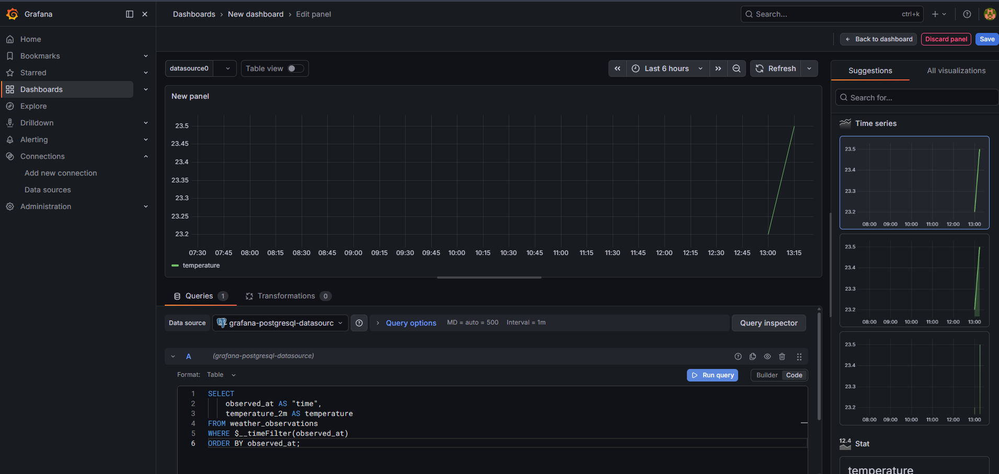
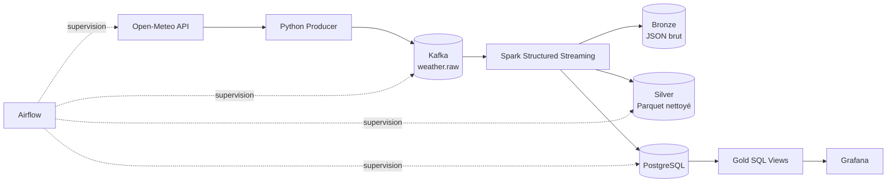

# Real-Time Weather Data Pipeline

Pipeline de données **near real-time** qui collecte les observations météo d'Open-Meteo, les transporte avec Kafka, les transforme avec Spark Structured Streaming, les stocke en fichiers et dans PostgreSQL, puis les visualise dans Grafana.



## Architecture



## Fonctionnalités

- collecte configurable d'une ville via l'API gratuite Open-Meteo ;
- production d'événements JSON dans Kafka ;
- traitement continu par micro-batches Spark ;
- stockage Bronze en JSON et Silver en Parquet ;
- chargement PostgreSQL pour les usages analytiques ;
- vues Gold SQL : dernières valeurs et agrégats horaires ;
- dashboard Grafana provisionné automatiquement ;
- DAG Airflow de contrôle de santé du pipeline ;
- exécution complète avec Docker Compose ;
- CI GitHub pour valider le Python et la configuration YAML.

## Démarrage rapide

### Prérequis

- Docker Desktop ou Docker Engine ;
- Docker Compose v2 ;
- environ 6 Go de mémoire disponibles.

### 1. Configurer l'environnement

Sous Git Bash, Linux ou macOS :

```bash
cp .env.example .env
```

Sous PowerShell :

```powershell
Copy-Item .env.example .env
```

Les valeurs de `.env.example` sont uniquement destinées à un environnement local. Tu peux modifier les mots de passe dans `.env`.

### 2. Valider la configuration

```bash
docker compose config
```

### 3. Construire et démarrer

```bash
docker compose up --build -d
```

### 4. Vérifier les conteneurs

```bash
docker compose ps
```

Attends une à deux minutes au premier lancement : Spark télécharge ses connecteurs Maven et Airflow initialise sa base.

## Interfaces

| Service | Adresse | Identifiants |
|---|---|---|
| Grafana | http://localhost:3001 | définis dans `.env` |
| Airflow | http://localhost:8080 | définis dans `.env` |
| Kafka UI | http://localhost:8081 | aucun |
| Spark UI | http://localhost:4040 | disponible pendant le job |
| PostgreSQL | `localhost:5433` | définis dans `.env` |

Grafana est déjà provisionné avec :

- une source PostgreSQL ;
- un dashboard **Weather Monitoring** ;
- une variable permettant de choisir la ville ;
- des panneaux température, humidité, vent et précipitations.

## Commandes essentielles

### Suivre les logs

```bash
docker compose logs -f weather-producer
docker compose logs -f spark-streaming
docker compose logs -f airflow-scheduler
```

`Ctrl+C` quitte seulement l'affichage des logs. Les conteneurs continuent de fonctionner en arrière-plan.

### Lire quelques événements Kafka

```bash
docker compose exec kafka kafka-console-consumer \
  --bootstrap-server kafka:29092 \
  --topic weather.raw \
  --from-beginning \
  --max-messages 5
```

### Interroger PostgreSQL

```bash
docker compose exec weather-db \
  psql -U weather_user -d weather \
  -c "SELECT city, ingested_at, temperature_2m FROM weather_latest;"
```

Avec DBeaver :

```text
Host     : localhost
Port     : 5433
Database : weather
User     : weather_user
Password : valeur de WEATHER_DB_PASSWORD
```

### Arrêter

Conserver les données :

```bash
docker compose down
```

Supprimer aussi les volumes PostgreSQL, Kafka, Grafana et Airflow :

```bash
docker compose down -v
```

Les dossiers locaux `data/bronze`, `data/silver` et `data/checkpoints` sont des montages de répertoires. Pour repartir totalement de zéro, supprime aussi leur contenu.

### Reconstruire un seul service

```bash
docker compose build --no-cache spark-streaming
docker compose up -d spark-streaming
```

## Couches de données

### Bronze

Copie fidèle des événements Kafka au format JSON. Cette couche sert à l'audit et au retraitement.

```text
data/bronze/
```

### Silver

Données typées, validées et dédupliquées dans chaque micro-batch, écrites en Parquet et partitionnées par ville et date.

```text
data/silver/
```

### Gold

Vues PostgreSQL destinées aux usages métier :

- `weather_observations_dedup` : événements dédupliqués ;
- `weather_latest` : dernière observation reçue par ville ;
- `weather_hourly` : moyennes et agrégats horaires.

Grafana interroge ces vues plutôt que les fichiers Parquet.

## Schéma PostgreSQL

La table `weather_observations` est créée automatiquement au premier démarrage par :

```text
postgres/init.sql
```

Les scripts placés dans `/docker-entrypoint-initdb.d` ne sont exécutés que lorsque le volume PostgreSQL est vide. Après une modification de `init.sql`, tu peux :

- exécuter manuellement le SQL dans DBeaver ; ou
- repartir de zéro avec `docker compose down -v` — cette commande supprime les données des volumes.

## Orchestration Airflow

Le DAG `weather_pipeline_monitoring` vérifie toutes les dix minutes :

1. que l'API Open-Meteo répond ;
2. que le topic Kafka existe ;
3. qu'un événement récent arrive dans Kafka ;
4. que Spark produit des fichiers Silver ;
5. que PostgreSQL contient des observations.

Kafka et Spark restent des services continus. Airflow les supervise ; il ne remplace pas le moteur de streaming.

## Organisation

```text
.
├── .github/workflows/ci.yml
├── airflow/
│   ├── dags/weather_pipeline_monitoring.py
│   ├── Dockerfile
│   └── requirements.txt
├── data/
│   ├── bronze/.gitkeep
│   ├── checkpoints/.gitkeep
│   └── silver/.gitkeep
├── docs/
│   ├── COURSE.md
│   ├── INTERVIEW.md
│   ├── TROUBLESHOOTING.md
│   ├── images/
│   └── manual/
├── grafana/
│   ├── dashboards/weather-dashboard.json
│   └── provisioning/
├── postgres/init.sql
├── producer/
├── scripts/validate.py
├── spark/
├── .env.example
├── .gitignore
├── docker-compose.yml
├── LICENSE
└── Makefile
```

## Configuration d'une autre ville

Modifie `.env` :

```dotenv
CITY_NAME=Lyon
LATITUDE=45.7640
LONGITUDE=4.8357
```

Puis recrée le producteur :

```bash
docker compose up -d --force-recreate weather-producer
```

Pour un vrai pipeline multi-villes, la prochaine évolution consiste à faire accepter au producteur une liste de coordonnées et à produire une observation par ville.

## Limites connues

- Le producteur interroge l'API toutes les 30 secondes par défaut, mais la donnée source ne change pas nécessairement à cette fréquence.
- Il s'agit donc d'un pipeline **near real-time**, pas d'un système temps réel strict.
- Les mots de passe d'exemple sont adaptés au développement local uniquement.
- Le déploiement sur Internet nécessiterait TLS, un gestionnaire de secrets, des règles réseau et une authentification renforcée.
- Les images sont volontairement épinglées pour améliorer la reproductibilité.

## Validation locale

```bash
python scripts/validate.py
```

## Documentation

- [Cours et notions](docs/COURSE.md)
- [Dépannage](docs/TROUBLESHOOTING.md)
- [Présentation en entretien](docs/INTERVIEW.md)
- [Manuel PDF](docs/manual/Manuel_Pipeline_Data_Engineering_Temps_Reel.pdf)

## Licence

Ce projet est distribué sous licence MIT.
